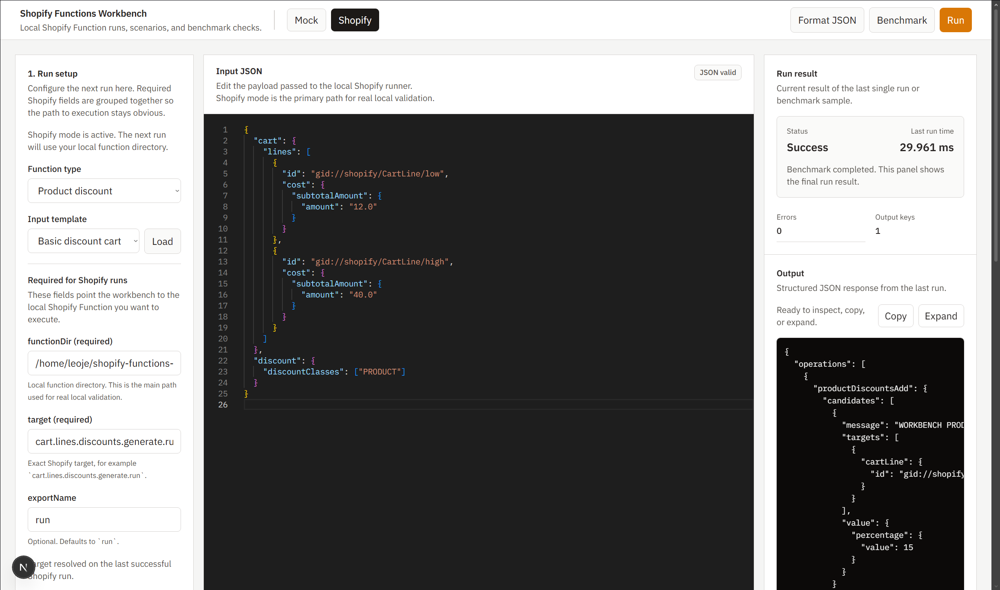

# Shopify Functions Workbench

Open-source local workbench for running, benchmarking, and debugging Shopify Functions before deployment.

## Screenshot



The project is organized as a simple monorepo:

- `frontend/`: Next.js UI with Monaco Editor and Tailwind CSS
- `backend/`: NestJS API exposing a local `/run` endpoint
- `examples/`: official validation example packages

## Quick Start

Requirements:

- Node.js 20+
- npm
- Shopify CLI for the real Shopify runner path

Install and start the workbench from the repository root:

```bash
npm install
npm run dev
```

This starts:

- frontend on `http://localhost:3000`
- backend on `http://localhost:3001`

Open `http://localhost:3000` in the browser.

The frontend calls the backend using:

```bash
NEXT_PUBLIC_API_BASE_URL=http://localhost:3001
```

If you need to override it, create a local `.env` file from `./.env.example`.

## First Real Shopify Run

Use one of the official example packages in `examples/`.

In the UI:

- switch to `Shopify`
- `functionDir`: `examples/shopify-product-discount/extensions/workbench-product-discount`
- `target`: `cart.lines.discounts.generate.run`
- `exportName`: `run`
- `inputJson`: paste `examples/shopify-product-discount/input/product-discount.input.json`

You can also validate the real runner with:

- `examples/shopify-delivery-customization/extensions/workbench-delivery-customization`
- `examples/shopify-cart-transform/extensions/workbench-cart-transform`

Expected result:

- `success: true`
- one `productDiscountsAdd` operation
- message `WORKBENCH PRODUCT TEST`
- percentage `15`
- target cart line `gid://shopify/CartLine/high`

Security note:

- only run trusted Wasm locally
- the workbench is a local developer tool, not a hardened security sandbox for untrusted Wasm
- local timings are diagnostics only and may differ from Shopify production runtime performance

## Current MVP Status

Implemented:

- monorepo with separate frontend and backend apps
- `POST /run` backend endpoint
- benchmark workflow on the same `/run` endpoint
- multipart upload support for a `.wasm` file
- JSON input handling
- real Shopify execution path using Shopify CLI metadata and `function-runner`
- function type selection for:
  - `product-discount`
  - `delivery-customization`
  - `cart-transform`
  - `custom`
- frontend single-page runner UI
- fixed-height desktop workspace with three panels
- Monaco JSON editor
- explicit mock vs Shopify runner modes
- saved local scenarios in the browser
- scenario import/export as JSON for the current runner mode
- structured error details and Shopify runner diagnostics
- benchmark inputs and benchmark result panels
- run result inspector with inline output actions and a details drawer

Current limitation:

- mock mode still exists for DX and payload iteration
- real Shopify execution requires a local function directory and target metadata
- local timings are useful for comparison, not as Shopify production guarantees
- the official examples cover product discount, delivery customization, and cart transform

## Tech Stack

- Frontend: Next.js, React, Tailwind CSS, Monaco Editor
- Backend: NestJS, TypeScript
- Runtime target: local WASI-compatible execution

## Project Structure

```text
Shopify-Functions-Workbench/
├── examples/
│   ├── shopify-product-discount/
│   ├── shopify-delivery-customization/
│   └── shopify-cart-transform/
├── backend/
│   ├── src/
│   └── test/
├── frontend/
│   ├── app/
│   ├── components/
│   └── lib/
└── README.md
```

## API Contract

### `POST /run`

Request uses `multipart/form-data`:

- `wasm`: uploaded `.wasm` file
- `inputJson`: JSON payload as string
- `functionType`: string
- `functionType` is assistive and can fall back to `custom` in mock mode
- `functionDir` (optional): local Shopify function directory
- `target` (optional): Shopify target key
- `exportName` (optional): function export name, defaults to `run`

Response:

```json
{
  "success": true,
  "output": {},
  "executionTimeMs": 0.42,
  "errors": [],
  "errorDetails": [],
  "diagnostics": {
    "requestedRunnerMode": "shopify",
    "actualRunnerMode": "shopify",
    "benchmarkEnabled": false
  },
  "timings": {
    "parseMs": 0.02,
    "executionMs": 0.4,
    "totalMs": 0.42
  }
}
```

## Run Locally

For a lighter development mode with lower memory pressure:

```bash
npm run dev:light
```

You can also run each app separately:

```bash
npm run dev:frontend
npm run dev:backend
npm run dev:frontend:light
npm run dev:backend:light
```

## Runner Modes

### Mock mode

Used when only JSON, templates, and an optional `.wasm` file are provided.

- fast local feedback
- no Shopify CLI metadata required
- useful for UI and payload iteration
- unknown or omitted function types fall back to `custom`
- only run trusted Wasm locally

### Real Shopify mode

Used when `functionDir` and `target` are provided.

- backend resolves `functionRunnerPath`, `schemaPath`, `wasmPath`, and targeting via Shopify CLI
- backend invokes Shopify's official `function-runner`
- an uploaded `.wasm` file overrides the built Wasm for that single run
- only run trusted Wasm locally

## Common Failures

- `Both functionDir and target are required`:
  you filled only one of the Shopify runner fields.
- `Unknown target ...`:
  the target does not exist in `shopify.extension.toml`.
- `failed to find function export`:
  the target export and the selected function build do not match; check `exportName` and `shopify.extension.toml`.
- `functionDir does not exist`:
  the path is wrong or points to a deleted local directory.
- `Wasm build was not found`:
  the function directory exists, but the expected build output is missing.
- `Input JSON is invalid`:
  the JSON payload could not be parsed before execution.

## Scenarios

- the UI can save named local scenarios to browser local storage
- a scenario stores runner mode, function type, JSON input, Shopify runner fields, and benchmark defaults
- saving prompts before overwriting a scenario with the same name in the same mode
- scenarios can be renamed, deleted, exported as JSON, and imported on another machine or browser
- the latest benchmark summary can be attached to a saved scenario for quick local comparison
- legacy scenario storage from the old project name is migrated automatically in the browser
- scenarios are intended for fast local iteration, not source-controlled test cases

## Interface Notes

- the desktop UI is organized as `setup / input / result`
- benchmark and saved scenarios are collapsed by default to keep the primary flow readable
- output actions are available directly inside the output frame
- detailed timings, benchmark breakdown, and Shopify diagnostics live behind the result drawer instead of the main inspector

## Official Examples

- `examples/shopify-product-discount/README.md`: `cart.lines.discounts.generate.run`
- `examples/shopify-delivery-customization/README.md`: `purchase.delivery-customization.run`
- `examples/shopify-cart-transform/README.md`: `purchase.cart-transform.run`
- every example includes a prebuilt `dist/function.wasm`, source files, and a ready-to-run input payload

## Development Commands

From the repository root:

```bash
npm run dev
npm run dev:light
npm run dev:frontend
npm run dev:backend
npm run dev:frontend:light
npm run dev:backend:light
npm run build
npm run lint
npm run test
```

More granular commands:

```bash
npm run build:frontend
npm run build:backend
npm run benchmark:shopify -- --help
npm run lint:frontend
npm run lint:backend
npm run test:backend
npm run test:frontend
npm run test:e2e
```

## Verification

Equivalent app-level commands still work inside `frontend/` and `backend/`, but the root scripts are intended to be the default entry point.

Backend:

```bash
cd backend
npm run build
npm test -- --runInBand
npm run test:e2e -- --runInBand
```

Frontend:

```bash
cd frontend
npm run build
npm run lint
npm test
```

## Known Limitations

- Shopify mode still depends on local Shopify CLI metadata and a buildable local function directory
- local benchmark numbers include machine, OS, and runner overhead
- the workbench does not sandbox untrusted Wasm
- the bundled examples validate the workbench path, but they are not full production Shopify app templates
- benchmark history is intentionally lightweight and stays browser-local

## Roadmap

- expand real Shopify validation coverage and remediation messages
- add more official example packages and scenario presets
- keep improving benchmark UX without presenting local timings as production truth
- continue hardening docs and contributor onboarding for external devs
- mock mode is intentionally approximate and should not be treated as a Shopify-accurate runtime

## Contributing

See [`CONTRIBUTING.md`](CONTRIBUTING.md) for local validation commands and contribution guidelines.

## Performance Notes

- `npm run dev` uses webpack on the frontend instead of Turbopack to avoid the process explosion seen in this environment
- `npm run dev:light` disables frontend dev source maps and server fast refresh to reduce CPU and memory usage further
- the backend dev server uses Nest watch mode with the `swc` builder, which is lighter than the default TypeScript watch path
- real Shopify runs now return detailed local phase timings such as parse, execution, `functionInfo`, and `functionRunner`
- those timings are useful for comparing local runs, but they are not Shopify production timings and should not be treated as acceptance thresholds
- you can benchmark the backend without the browser using:

```bash
npm run benchmark:shopify -- \
  --function-dir /abs/path/to/function \
  --target cart.lines.discounts.generate.run \
  --input-file /abs/path/to/input.json \
  --export-name run \
  --warmup 1 \
  --iterations 5
```
